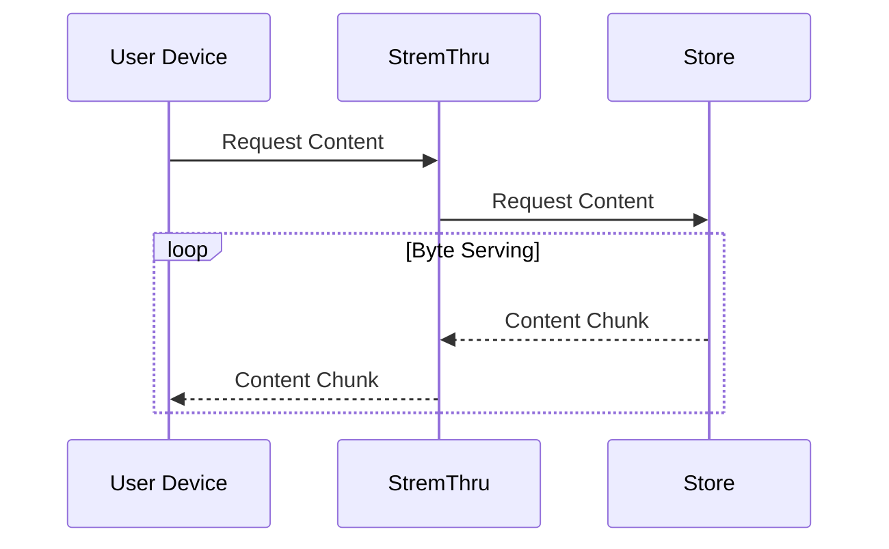
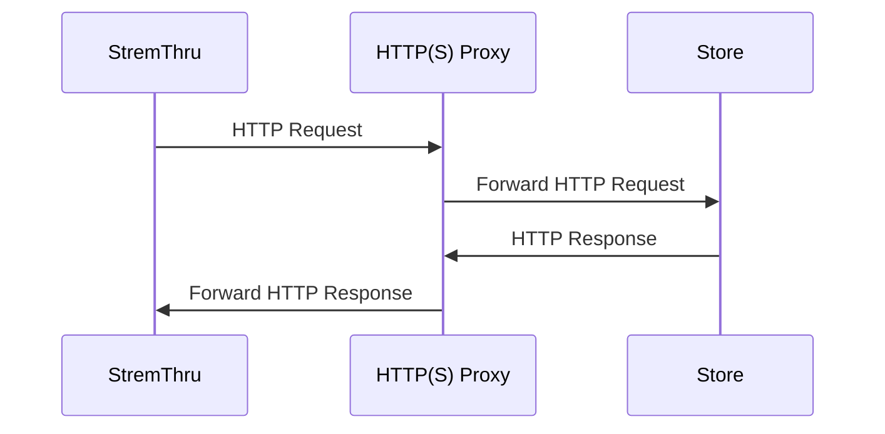

[](https://github.com/MunifTanjim/stremthru/blob/master/LICENSE)

# StremThru (Fork)

> This is a fork of **[StremThru](https://github.com/MunifTanjim/stremthru)** by [MunifTanjim](https://github.com/MunifTanjim) — the companion for Stremio.
>
> This fork adds support for additional debrid providers while maintaining full compatibility with the upstream project.

---

## Changes From Upstream

### New Debrid Providers

| Provider | Store Code | API Base | Auth Method |
|---|---|---|---|
| **DeepBrid** | `db` | `https://www.deepbrid.com/api/v1/` | Bearer token (API key) |
| **Put.io** | `pi` | `https://api.put.io/v2/` | OAuth Bearer token |

#### DeepBrid (`deepbrid` / `db`)

[DeepBrid](https://www.deepbrid.com) is a premium link generator and torrent debrid service with support for 80+ file hosts, Usenet, and video streaming. This integration provides:

- **User info** — account type, email, expiration status
- **Magnet management** — add torrents via magnet link, check status, list all torrents
- **Link generation** — generate direct download links from cached torrent files
- **Buddy/peer cache** — participates in the stremthru distributed cache for faster availability checks

API key available at: [deepbrid.com/api](https://www.deepbrid.com/api-docs)

#### Put.io (`putio` / `pi`)

[Put.io](https://put.io) is a cloud-based seedbox and file storage service with torrent downloading, RSS feeds, and file streaming. This integration provides:

- **User info** — account details and plan expiration
- **Transfer management** — add torrents via magnet link (as transfers), list active transfers, remove transfers
- **File listing** — browse files within completed transfers
- **Link generation** — generate direct download links for individual files
- **Transfer-to-magnet mapping** — transparently maps Put.io's transfer model to stremthru's magnet interface

OAuth token available at: [app.put.io/settings/account/oauth](https://app.put.io/settings/account/oauth)

### How Stores Are Added

The integration touches these components to fully register each new store:

| Component | File(s) | Purpose |
|---|---|---|
| Store registry | `store/store.go` | Registers store name constants, codes, and lookup maps |
| API client | `store/<name>/client.go` | HTTP client with auth, request building, error handling |
| API types | `store/<name>/response.go` | Request/response structs for all API endpoints |
| Store logic | `store/<name>/store.go` | `Store` interface implementation (user, magnets, links) |
| Error translation | `store/<name>/error.go` | Maps provider errors to stremthru error codes |
| Shared config | `internal/shared/store.go` | Instantiates store client with tunnel-aware HTTP transport |
| Tunnel support | `internal/config/http.go` | Content CDN hostnames for proxy/tunnel routing |
| Configure UI | `internal/stremio/configure/configure_script.go` | Sign-up links and API key descriptions in Stremio addon UI |

---

## Configuration

To use the new stores, add them to `STREMTHRU_STORE_AUTH`:

```env
STREMTHRU_STORE_AUTH=user:deepbrid:YOUR_DEEPBRID_API_KEY,user:putio:YOUR_PUTIO_TOKEN
```

Example with multiple stores:

```env
STREMTHRU_STORE_AUTH=user:realdebrid:TOKEN,user:deepbrid:TOKEN,user:putio:TOKEN
```

Full configuration reference: [docs.stremthru.13377001.xyz](https://docs.stremthru.13377001.xyz/configuration)

---

## Features

- HTTP(S) Proxy
- Proxy Authorization
- [Byte Serving](https://en.wikipedia.org/wiki/Byte_serving)

### Store Integration

- [AllDebrid](https://alldebrid.com)
- [Debrider](https://debrider.app)
- [Debrid-Link](https://debrid-link.com/id/4v8Uc)
- **[DeepBrid](https://www.deepbrid.com)** 🆕
- [EasyDebrid](https://easydebrid.com)
- [Offcloud](https://offcloud.com/?=ce30ae1f)
- [PikPak](https://mypikpak.com/drive/activity/invited?invitation-code=46013321)
- [Premiumize](https://www.premiumize.me/ref/634502061)
- **[Put.io](https://put.io)** 🆕
- [RealDebrid](http://real-debrid.com/?id=12448969)
- [TorBox](https://torbox.app/subscription?referral=fbe2c844-4b50-416a-9cd8-4e37925f5dfa)

### SDK

- [JavaScript](./sdk/js)
- [Python](./sdk/py)

### Concepts

#### Store

_Store_ is an external service that provides access to content. StremThru acts as an interface for the _store_.

#### Store Content Proxy

StremThru can proxy the content from the _store_. For proxy authorized requests, this is enabled by default.



#### Store Tunnel

If you can't access the _store_ using your IP, you can use HTTP(S) Proxy to tunnel the traffic to the _store_.



## Configuration

Check [documentation](https://docs.stremthru.13377001.xyz/configuration).

### Stremio Addons

Check [documentation](https://docs.stremthru.13377001.xyz/stremio-addons).

## Upstream

- **Original:** [github.com/MunifTanjim/stremthru](https://github.com/MunifTanjim/stremthru)
- **Fork:** [github.com/obnoxiousmods/stremthru](https://github.com/obnoxiousmods/stremthru)

## Sponsors

- [DanaramaPyjama](https://x.com/danaramaps4)
- [Debridio](https://debridio.com)
- [FunkyPenguin](https://github.com/funkypenguin)

## License

Licensed under the MIT License. Check the [LICENSE](./LICENSE) file for details.
